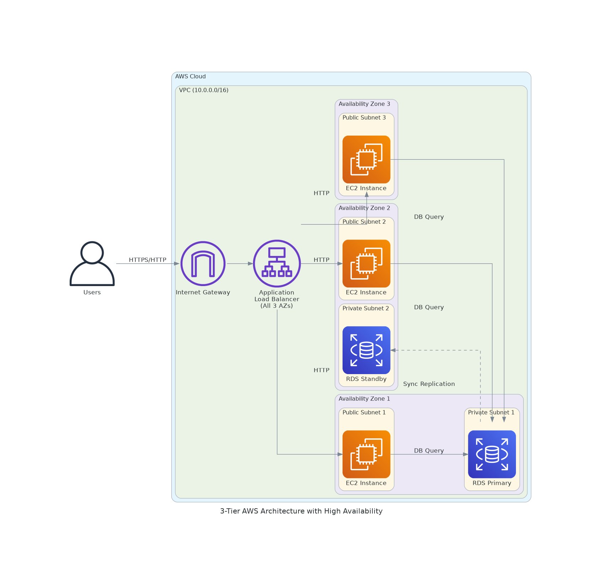

# Design Document: 3-Tier AWS Architecture with High Availability

## Overview

This design specifies a production-ready 3-tier AWS architecture implemented using Terraform. The architecture follows AWS best practices for high availability by distributing resources across three Availability Zones. The system consists of:

1. **Presentation Tier**: Application Load Balancer (ALB) in public subnets
2. **Application Tier**: Auto Scaling Group (ASG) of EC2 instances in public subnets
3. **Data Tier**: Multi-AZ RDS database in private subnets

The infrastructure is designed to tolerate the complete failure of an entire Availability Zone while maintaining service availability. All resources are provisioned using Terraform with a modular, maintainable code structure.

## Architecture

### High-Level Architecture

The architecture implements a standard 3-tier pattern with the following characteristics:

- **Region**: Single AWS region with 3 Availability Zones
- **Network**: VPC with public and private subnets across all AZs
- **Load Balancing**: Internet-facing ALB distributing traffic across EC2 instances
- **Compute**: Auto Scaling Group maintaining EC2 instances across all AZs
- **Database**: Multi-AZ RDS with automatic failover capability
- **Security**: Layered security groups implementing least privilege access

### Network Architecture

**VPC Structure**:
- Single VPC with configurable CIDR block (e.g., 10.0.0.0/16)
- 3 Public Subnets (one per AZ) for internet-facing resources
- 3 Private Subnets (one per AZ) for database resources
- Internet Gateway for public subnet internet access

**Subnet Allocation**:
- Public Subnets: Calculated from VPC CIDR with non-overlapping ranges
- Private Subnets: Calculated from VPC CIDR with non-overlapping ranges
- Each subnet sized appropriately for expected resource count

**Routing**:
- Public route table: Routes 0.0.0.0/0 to Internet Gateway
- Private route table: No internet route (isolated for database security)

### Load Balancer Tier

**Application Load Balancer**:
- Type: Internet-facing ALB
- Placement: Spans all 3 public subnets
- Listeners: HTTP (port 80) and HTTPS (port 443)
- Target Group: Routes to EC2 instances with health checks
- Health Check: Configurable path, interval, and thresholds

**ALB Security Group**:
- Ingress: Allow HTTP (80) and HTTPS (443) from 0.0.0.0/0
- Egress: Allow all outbound traffic to EC2 security group

### Application Tier

**Auto Scaling Group**:
- Launch Template: Defines EC2 instance configuration
- Instance Type: Configurable (e.g., t3.micro, t3.small)
- Capacity: Configurable min, max, and desired counts
- Distribution: Even distribution across all 3 AZs
- Target Group: Attached to ALB target group for traffic routing

**EC2 Security Group**:
- Ingress: Allow traffic from ALB security group only
- Egress: Allow all outbound traffic (for internet access and RDS)

### Data Tier

**RDS Database**:
- Deployment: Multi-AZ enabled for automatic failover
- Engine: Configurable (e.g., MySQL, PostgreSQL)
- Instance Class: Configurable (e.g., db.t3.micro)
- Subnet Group: Spans all 3 private subnets
- Backups: Automated backups enabled with configurable retention
- Storage: Configurable size with encryption at rest

**RDS Security Group**:
- Ingress: Allow database port traffic from EC2 security group only
- Egress: No outbound rules needed (RDS is destination only)

### High Availability Design

**Zone Distribution**:
- All resources distributed across 3 Availability Zones
- ALB automatically routes to healthy targets in any AZ
- ASG maintains desired capacity across all AZs
- RDS Multi-AZ provides automatic failover to standby in different AZ

**Failure Scenarios**:
- Single AZ failure: ALB routes to instances in remaining 2 AZs
- Instance failure: ASG replaces failed instances automatically
- RDS primary failure: Automatic failover to standby in different AZ
- ALB failure: AWS-managed service with built-in redundancy

## Components and Interfaces

### Terraform Module Structure

The Terraform code is organized into the following files:

**main.tf**:
- VPC and networking resources (VPC, subnets, IGW)
- Route tables and associations
- Data sources for availability zones

**alb.tf**:
- Application Load Balancer
- Target group with health checks
- ALB listeners (HTTP/HTTPS)
- ALB security group

**asg.tf**:
- Launch template for EC2 instances
- Auto Scaling Group configuration
- EC2 security group

**rds.tf**:
- RDS subnet group
- RDS instance with Multi-AZ
- RDS security group

**variables.tf**:
- Input variables for all configurable parameters
- Variable validation rules

**outputs.tf**:
- ALB DNS name
- RDS endpoint
- VPC ID and subnet IDs
- Security group IDs

**versions.tf**:
- Terraform version constraints
- AWS provider version constraints

### Key Terraform Resources

**VPC Module** (using terraform-aws-modules/vpc/aws):
- Manages VPC, subnets, IGW, and route tables
- Provides consistent subnet allocation
- Handles availability zone distribution

**ALB Resources**:
- `aws_lb`: Application Load Balancer
- `aws_lb_target_group`: Target group for EC2 instances
- `aws_lb_listener`: HTTP/HTTPS listeners
- `aws_security_group`: ALB security group

**ASG Resources**:
- `aws_launch_template`: EC2 instance template
- `aws_autoscaling_group`: Auto Scaling Group
- `aws_autoscaling_attachment`: Attach ASG to target group
- `aws_security_group`: EC2 security group

**RDS Resources**:
- `aws_db_subnet_group`: RDS subnet group
- `aws_db_instance`: RDS database instance
- `aws_security_group`: RDS security group

### Naming Conventions

All resources follow the project naming schema:

**Standard Resources** (S3, EC2, RDS, VPC, etc.):
- Pattern: `[service]-[project]-[app]-[env]-[purpose]`
- Example: `vpc-tilt-sensor-lab-main`
- Example: `alb-tilt-sensor-lab-web`

**Hierarchical Services** (Parameter Store / Secrets Manager):
- Pattern: `[service]/[project]/[app]/[env]/[purpose]`
- Example: `ssm/tilt/sensor/lab/db_password`

**CloudWatch Log Groups**:
- Pattern: `/[provider]/[service]/[project]/[app]/[env]/[purpose]`
- Example: `/aws/rds/tilt/sensor/lab/error_logs`

### Resource Tags

All resources include the following mandatory tags:
- `Project`: "KiroDemo"
- `Environment`: "Lab"
- `CreatedBy`: "Toan-Tran"
- `ManagedBy`: "Terraform"

## Data Models

### Terraform Variables

**Network Configuration**:
```hcl
variable "vpc_cidr" {
  type        = string
  description = "CIDR block for VPC"
  default     = "10.0.0.0/16"
}

variable "availability_zones" {
  type        = list(string)
  description = "List of availability zones (must be exactly 3)"
  validation {
    condition     = length(var.availability_zones) == 3
    error_message = "Exactly 3 availability zones must be specified"
  }
}
```

**ALB Configuration**:
```hcl
variable "alb_health_check_path" {
  type        = string
  description = "Health check path for ALB target group"
  default     = "/"
}

variable "alb_health_check_interval" {
  type        = number
  description = "Health check interval in seconds"
  default     = 30
}
```

**ASG Configuration**:
```hcl
variable "instance_type" {
  type        = string
  description = "EC2 instance type"
  default     = "t3.micro"
}

variable "asg_min_size" {
  type        = number
  description = "Minimum number of instances"
  default     = 3
}

variable "asg_max_size" {
  type        = number
  description = "Maximum number of instances"
  default     = 9
}

variable "asg_desired_capacity" {
  type        = number
  description = "Desired number of instances"
  default     = 3
}
```

**RDS Configuration**:
```hcl
variable "db_engine" {
  type        = string
  description = "Database engine (mysql, postgres, etc.)"
  default     = "mysql"
}

variable "db_engine_version" {
  type        = string
  description = "Database engine version"
  default     = "8.0"
}

variable "db_instance_class" {
  type        = string
  description = "RDS instance class"
  default     = "db.t3.micro"
}

variable "db_allocated_storage" {
  type        = number
  description = "Allocated storage in GB"
  default     = 20
}

variable "db_name" {
  type        = string
  description = "Database name"
}

variable "db_username" {
  type        = string
  description = "Database master username"
  sensitive   = true
}

variable "db_password" {
  type        = string
  description = "Database master password"
  sensitive   = true
}
```

### Terraform Outputs

**Network Outputs**:
```hcl
output "vpc_id" {
  description = "VPC ID"
  value       = module.vpc.vpc_id
}

output "public_subnet_ids" {
  description = "List of public subnet IDs"
  value       = module.vpc.public_subnets
}

output "private_subnet_ids" {
  description = "List of private subnet IDs"
  value       = module.vpc.private_subnets
}
```

**ALB Outputs**:
```hcl
output "alb_dns_name" {
  description = "DNS name of the Application Load Balancer"
  value       = aws_lb.main.dns_name
}

output "alb_arn" {
  description = "ARN of the Application Load Balancer"
  value       = aws_lb.main.arn
}
```

**RDS Outputs**:
```hcl
output "rds_endpoint" {
  description = "RDS instance endpoint"
  value       = aws_db_instance.main.endpoint
}

output "rds_address" {
  description = "RDS instance address"
  value       = aws_db_instance.main.address
}
```

### Security Group Rules

**ALB Security Group**:
- Ingress Rule 1: Protocol TCP, Port 80, Source 0.0.0.0/0
- Ingress Rule 2: Protocol TCP, Port 443, Source 0.0.0.0/0
- Egress Rule: Protocol -1 (all), Port 0, Destination EC2 security group

**EC2 Security Group**:
- Ingress Rule: Protocol TCP, Port 80, Source ALB security group
- Egress Rule: Protocol -1 (all), Port 0, Destination 0.0.0.0/0

**RDS Security Group**:
- Ingress Rule: Protocol TCP, Port 3306 (MySQL) or 5432 (PostgreSQL), Source EC2 security group
- No egress rules (RDS is destination only)


### Architecture Diagram



The diagram illustrates:
- **Users**: External users accessing the application via internet
- **Internet Gateway**: Provides internet connectivity for the VPC
- **Application Load Balancer**: Internet-facing ALB spanning all 3 Availability Zones, distributing traffic
- **Availability Zone 1**: Public subnet with EC2 instance; Private subnet with RDS Primary
- **Availability Zone 2**: Public subnet with EC2 instance; Private subnet with RDS Standby
- **Availability Zone 3**: Public subnet with EC2 instance; Private subnet (part of RDS subnet group, no active DB instance)
- **Auto Scaling Group**: Three EC2 instances, one in each AZ's public subnet
- **RDS Multi-AZ**: Primary database in AZ-1 with synchronous standby replica in AZ-2; AZ-3 private subnet is part of the RDS subnet group for potential failover
- **Traffic Flow**: Users → Internet Gateway → ALB → EC2 instances (in each AZ) → RDS primary database
- **High Availability**: All resources distributed across 3 AZs for fault tolerance; any single AZ failure is tolerated


## Correctness Properties

*A property is a characteristic or behavior that should hold true across all valid executions of a system—essentially, a formal statement about what the system should do. Properties serve as the bridge between human-readable specifications and machine-verifiable correctness guarantees.*

The following properties define the correctness criteria for the Terraform code generator. Each property is universally quantified and can be verified through property-based testing.

### Network Infrastructure Properties

**Property 1: VPC Creation with Configurable CIDR**
*For any* valid CIDR block provided as input, the generated Terraform code should contain a VPC resource with that exact CIDR block configured.
**Validates: Requirements 1.1**

**Property 2: Subnet Count and Distribution**
*For any* generated Terraform configuration, the code should contain exactly 3 public subnet resources and exactly 3 private subnet resources, each in a different Availability Zone.
**Validates: Requirements 1.2, 1.3**

**Property 3: Internet Gateway Attachment**
*For any* generated Terraform configuration, the code should contain an Internet Gateway resource with an attachment to the VPC.
**Validates: Requirements 1.4**

**Property 4: Public Route Table Configuration**
*For any* generated Terraform configuration, all public subnet route tables should contain a route directing 0.0.0.0/0 traffic to the Internet Gateway.
**Validates: Requirements 1.6**

**Property 5: Non-Overlapping CIDR Blocks**
*For any* VPC CIDR block and generated subnet configuration, all subnet CIDR blocks should be non-overlapping and fall within the VPC CIDR range.
**Validates: Requirements 1.8**

### Load Balancer Properties

**Property 6: ALB in Public Subnets**
*For any* generated Terraform configuration, the Application Load Balancer resource should reference all 3 public subnet IDs.
**Validates: Requirements 2.1, 2.8**

**Property 7: ALB Internet-Facing Configuration**
*For any* generated Terraform configuration, the ALB resource should have the `internal` attribute set to `false` or omitted (defaults to internet-facing).
**Validates: Requirements 2.2**

**Property 8: Target Group Creation**
*For any* generated Terraform configuration, the code should contain a target group resource associated with the ALB.
**Validates: Requirements 2.3**

**Property 9: Health Check Configuration**
*For any* generated Terraform configuration, the target group resource should contain health check configuration with path, interval, and threshold settings.
**Validates: Requirements 2.4**

**Property 10: ALB Security Group Ingress Rules**
*For any* generated Terraform configuration, the ALB security group should have exactly two ingress rules: one for port 80 from 0.0.0.0/0 and one for port 443 from 0.0.0.0/0.
**Validates: Requirements 2.5, 2.6**

**Property 11: ALB HTTP Listener**
*For any* generated Terraform configuration, the code should contain an ALB listener resource for port 80 that forwards to the target group.
**Validates: Requirements 2.7**

### Auto Scaling Group Properties

**Property 12: Launch Template with Configurable Instance Type**
*For any* instance type provided as input, the generated launch template resource should specify that exact instance type.
**Validates: Requirements 3.1**

**Property 13: ASG Creation with Launch Template**
*For any* generated Terraform configuration, the Auto Scaling Group resource should reference the launch template.
**Validates: Requirements 3.2**

**Property 14: ASG Subnet Distribution**
*For any* generated Terraform configuration, the ASG resource should reference all 3 public subnet IDs.
**Validates: Requirements 3.3, 3.8**

**Property 15: ASG Capacity Configuration**
*For any* min, max, and desired capacity values provided as input, the generated ASG resource should contain those exact values.
**Validates: Requirements 3.4**

**Property 16: ASG Target Group Attachment**
*For any* generated Terraform configuration, the code should contain a resource or configuration that attaches the ASG to the ALB target group.
**Validates: Requirements 3.5**

**Property 17: EC2 Security Group Ingress from ALB**
*For any* generated Terraform configuration, the EC2 security group should have an ingress rule that references the ALB security group ID (not CIDR blocks).
**Validates: Requirements 3.6, 5.5**

**Property 18: EC2 Security Group Egress**
*For any* generated Terraform configuration, the EC2 security group should have an egress rule allowing all outbound traffic to 0.0.0.0/0.
**Validates: Requirements 3.7**

### RDS Database Properties

**Property 19: RDS Subnet Group with Private Subnets**
*For any* generated Terraform configuration, the RDS subnet group resource should reference all 3 private subnet IDs.
**Validates: Requirements 4.1**

**Property 20: RDS Multi-AZ Enabled**
*For any* generated Terraform configuration, the RDS instance resource should have `multi_az = true`.
**Validates: Requirements 4.2, 4.8, 7.2**

**Property 21: RDS Configurable Engine**
*For any* database engine provided as input, the generated RDS instance resource should specify that exact engine.
**Validates: Requirements 4.3**

**Property 22: RDS Configurable Instance Class**
*For any* instance class provided as input, the generated RDS instance resource should specify that exact instance class.
**Validates: Requirements 4.4**

**Property 23: RDS Security Group Ingress from EC2**
*For any* generated Terraform configuration and database engine, the RDS security group should have an ingress rule on the appropriate database port that references the EC2 security group ID (not CIDR blocks).
**Validates: Requirements 4.5, 5.5**

**Property 24: RDS Subnet Group Reference**
*For any* generated Terraform configuration, the RDS instance resource should reference the RDS subnet group.
**Validates: Requirements 4.6**

**Property 25: RDS Automated Backups**
*For any* generated Terraform configuration, the RDS instance resource should have automated backups enabled with a backup retention period greater than 0.
**Validates: Requirements 4.7**

### Security Properties

**Property 26: Explicit Security Group Rules**
*For any* generated Terraform configuration, all security group resources should have explicit ingress and egress rule definitions (no default rules).
**Validates: Requirements 5.1**

**Property 27: Security Group Isolation**
*For any* generated Terraform configuration, the security groups should enforce the following isolation: ALB accepts traffic only from internet (0.0.0.0/0), EC2 accepts traffic only from ALB security group, and RDS accepts traffic only from EC2 security group.
**Validates: Requirements 5.2, 5.3, 5.4**

**Property 28: Security Group Names and Descriptions**
*For any* generated Terraform configuration, all security group resources should have both `name` and `description` attributes defined.
**Validates: Requirements 5.6**

### Code Structure Properties

**Property 29: Logical File Organization**
*For any* generated Terraform configuration, the code should be organized into multiple files including at minimum: main.tf, alb.tf, asg.tf, rds.tf, variables.tf, outputs.tf, and versions.tf.
**Validates: Requirements 6.1**

**Property 30: Variables File Exists**
*For any* generated Terraform configuration, a variables.tf file should exist containing variable definitions for all configurable parameters.
**Validates: Requirements 6.2**

**Property 31: Outputs File Exists**
*For any* generated Terraform configuration, an outputs.tf file should exist containing output definitions for important resource attributes (ALB DNS, RDS endpoint, VPC ID, subnet IDs).
**Validates: Requirements 6.3**

**Property 32: Consistent Naming Conventions**
*For any* generated Terraform configuration, all resource names should follow the pattern `[service]-[project]-[app]-[env]-[purpose]` for standard resources.
**Validates: Requirements 6.4**

**Property 33: Mandatory Resource Tags**
*For any* generated Terraform configuration, all taggable resources should include the mandatory tags: Project, Environment, CreatedBy, and ManagedBy.
**Validates: Requirements 6.5**

**Property 34: Availability Zone Data Source**
*For any* generated Terraform configuration, the code should contain a data source that queries AWS availability zones dynamically.
**Validates: Requirements 6.6**

**Property 35: Valid HCL Syntax**
*For any* generated Terraform configuration, running `terraform validate` should return success (exit code 0).
**Validates: Requirements 6.7**

**Property 36: Terraform Style Conventions**
*For any* generated Terraform configuration, running `terraform fmt -check` should return success (exit code 0), indicating proper formatting.
**Validates: Requirements 6.8**

### High Availability Properties

**Property 37: Three Availability Zone Distribution**
*For any* generated Terraform configuration, all compute and network resources (public subnets, private subnets, ALB, ASG, RDS subnet group) should be distributed across exactly 3 Availability Zones.
**Validates: Requirements 7.1**

**Property 38: Health Check Configuration for High Availability**
*For any* generated Terraform configuration, the ALB target group should have health checks configured, and the ASG should be attached to the target group, ensuring traffic routes only to healthy instances.
**Validates: Requirements 7.3**


## Error Handling

### Input Validation

**CIDR Block Validation**:
- Validate VPC CIDR block format (e.g., 10.0.0.0/16)
- Ensure CIDR block size is appropriate (minimum /28, maximum /16)
- Validate subnet CIDR calculations don't exceed VPC CIDR range

**Availability Zone Validation**:
- Verify exactly 3 availability zones are specified or available
- Validate availability zones exist in the target AWS region
- Handle cases where fewer than 3 AZs are available in a region

**Instance Configuration Validation**:
- Validate instance types are valid AWS instance types
- Validate instance class formats for RDS
- Ensure capacity values are positive integers with min ≤ desired ≤ max

**Database Configuration Validation**:
- Validate database engine is supported (mysql, postgres, mariadb, etc.)
- Validate engine version compatibility
- Ensure database name follows naming conventions
- Validate credentials meet AWS password requirements

### Terraform Generation Errors

**Syntax Errors**:
- Run `terraform validate` on generated code
- Report specific syntax errors with line numbers
- Provide suggestions for fixing common syntax issues

**Resource Dependency Errors**:
- Ensure proper resource dependencies (e.g., VPC before subnets)
- Use implicit dependencies via resource references
- Add explicit `depends_on` only when necessary

**Naming Conflicts**:
- Check for duplicate resource names
- Ensure all resource names follow naming conventions
- Validate names don't exceed AWS length limits

### AWS API Errors

**Quota Limits**:
- Document AWS service quotas (VPCs per region, subnets per VPC, etc.)
- Provide clear error messages when quotas would be exceeded
- Suggest quota increase requests when appropriate

**Permission Errors**:
- Document required IAM permissions for Terraform execution
- Provide clear error messages for missing permissions
- Suggest specific IAM policy additions

**Resource Conflicts**:
- Handle cases where resources already exist
- Provide options for importing existing resources
- Suggest alternative naming or configuration

### Recovery Strategies

**Partial Failure Handling**:
- Terraform state management for partial deployments
- Use `terraform plan` before `terraform apply`
- Implement proper state locking to prevent concurrent modifications

**Rollback Procedures**:
- Document rollback procedures using `terraform destroy`
- Maintain backup of Terraform state files
- Provide guidance for manual resource cleanup if needed

**Validation Before Deployment**:
- Always run `terraform validate` before deployment
- Use `terraform plan` to preview changes
- Implement pre-deployment checks for critical configurations

## Testing Strategy

### Dual Testing Approach

The testing strategy employs both unit tests and property-based tests to ensure comprehensive coverage:

**Unit Tests**: Verify specific examples, edge cases, and error conditions
- Test specific CIDR block calculations
- Test specific security group rule configurations
- Test error handling for invalid inputs
- Test file generation for specific configurations

**Property-Based Tests**: Verify universal properties across all inputs
- Test properties hold for randomly generated valid inputs
- Ensure correctness across wide range of configurations
- Catch edge cases that might be missed by example-based tests

Both testing approaches are complementary and necessary for comprehensive coverage. Unit tests provide concrete examples and catch specific bugs, while property-based tests verify general correctness across all possible inputs.

### Property-Based Testing Configuration

**Testing Framework**: Use a property-based testing library appropriate for the implementation language:
- Python: Hypothesis
- TypeScript/JavaScript: fast-check
- Go: gopter
- Java: jqwik

**Test Configuration**:
- Minimum 100 iterations per property test (due to randomization)
- Each property test must reference its design document property
- Tag format: **Feature: spec-hooks-steering-mcp, Property {number}: {property_text}**

**Example Property Test Structure** (Python with Hypothesis):
```python
from hypothesis import given, strategies as st
import hcl2

@given(
    vpc_cidr=st.from_regex(r'^10\.\d{1,3}\.\d{1,3}\.\d{1,3}/\d{1,2}$', fullmatch=True)
)
def test_property_1_vpc_creation_with_configurable_cidr(vpc_cidr):
    """
    Feature: spec-hooks-steering-mcp, Property 1: VPC Creation with Configurable CIDR
    For any valid CIDR block provided as input, the generated Terraform code 
    should contain a VPC resource with that exact CIDR block configured.
    """
    # Generate Terraform code
    terraform_code = generate_terraform(vpc_cidr=vpc_cidr)
    
    # Parse generated code
    parsed = hcl2.loads(terraform_code['main.tf'])
    
    # Verify VPC resource exists with correct CIDR
    vpc_resources = [r for r in parsed.get('resource', {}).get('aws_vpc', {}).values()]
    assert len(vpc_resources) > 0, "No VPC resource found"
    assert vpc_resources[0]['cidr_block'] == vpc_cidr, f"VPC CIDR mismatch"
```

### Unit Testing Strategy

**File Organization Tests**:
- Test that all required files are generated (main.tf, alb.tf, asg.tf, rds.tf, variables.tf, outputs.tf, versions.tf)
- Test that files contain expected resource types
- Test that file structure follows Terraform conventions

**Resource Configuration Tests**:
- Test specific resource configurations with known inputs
- Test default values are applied correctly
- Test optional parameters are handled properly

**Security Group Tests**:
- Test ALB security group has HTTP and HTTPS ingress rules
- Test EC2 security group references ALB security group
- Test RDS security group references EC2 security group
- Test security group rules use references, not CIDR blocks for internal traffic

**Naming Convention Tests**:
- Test resource names follow the pattern `[service]-[project]-[app]-[env]-[purpose]`
- Test all resources have required tags
- Test names don't exceed AWS length limits

**Edge Case Tests**:
- Test with minimum VPC CIDR size (/28)
- Test with maximum VPC CIDR size (/16)
- Test with minimum ASG capacity (1)
- Test with different database engines (MySQL, PostgreSQL, MariaDB)

**Error Handling Tests**:
- Test invalid CIDR block formats are rejected
- Test invalid instance types are rejected
- Test capacity values where min > max are rejected
- Test missing required parameters are caught

### Integration Testing

**Terraform Validation**:
- Run `terraform validate` on all generated configurations
- Verify validation passes for all test cases
- Test that generated code has no syntax errors

**Terraform Formatting**:
- Run `terraform fmt -check` on all generated configurations
- Verify formatting follows Terraform style conventions
- Test that code is properly indented and formatted

**Terraform Plan**:
- Run `terraform plan` on generated configurations (requires AWS credentials)
- Verify plan shows expected resources
- Test that no errors occur during planning phase

**End-to-End Tests** (Optional, requires AWS account):
- Deploy generated infrastructure to test AWS account
- Verify all resources are created successfully
- Test high availability by simulating AZ failure
- Clean up resources after testing

### Test Coverage Goals

**Code Coverage**: Aim for 90%+ code coverage for the generator logic
**Property Coverage**: All 38 correctness properties must have corresponding property-based tests
**Edge Case Coverage**: All identified edge cases must have unit tests
**Error Path Coverage**: All error handling paths must be tested

### Continuous Integration

**Pre-commit Checks**:
- Run unit tests
- Run property-based tests
- Run Terraform validation on sample outputs
- Check code formatting

**CI Pipeline**:
- Run full test suite on every commit
- Generate test coverage reports
- Run Terraform validation on multiple sample configurations
- Fail build if any tests fail or coverage drops below threshold

**Test Execution Time**:
- Unit tests should complete in < 10 seconds
- Property-based tests should complete in < 60 seconds
- Full test suite should complete in < 2 minutes

